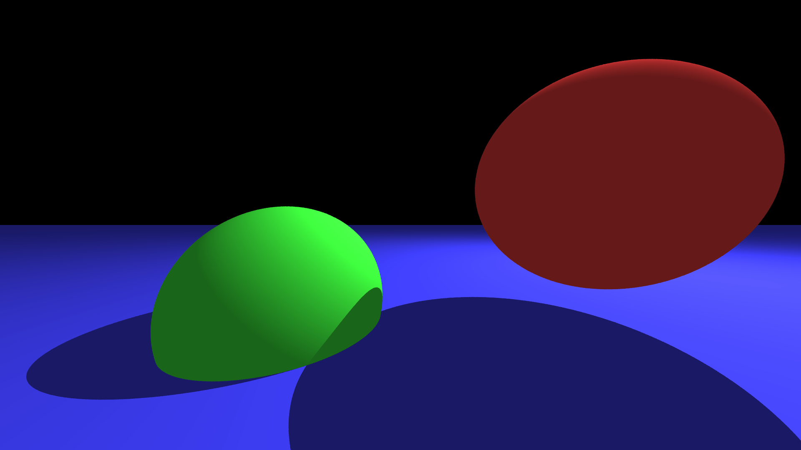
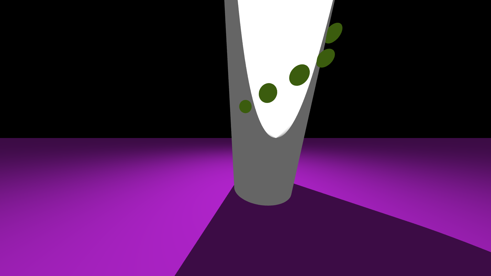
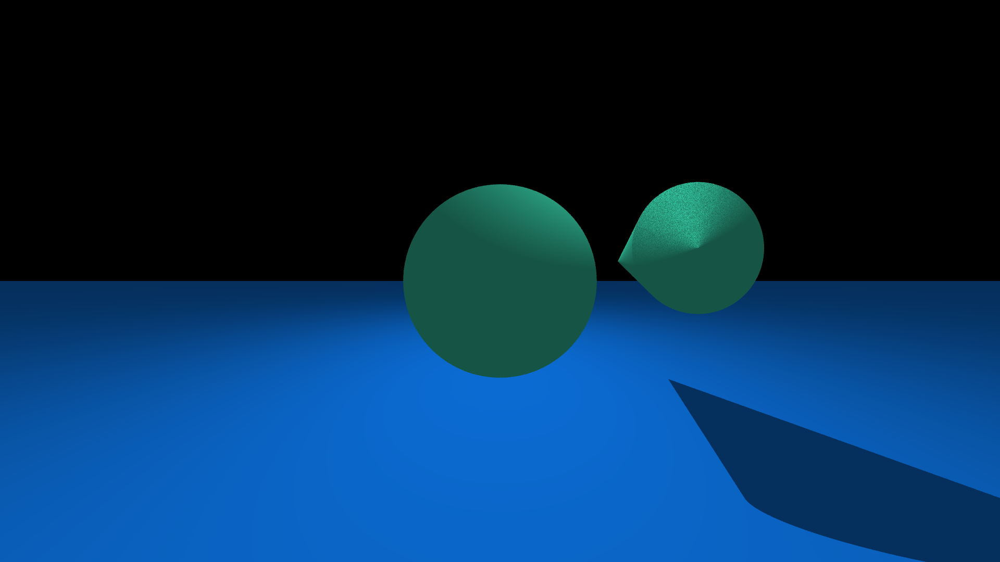
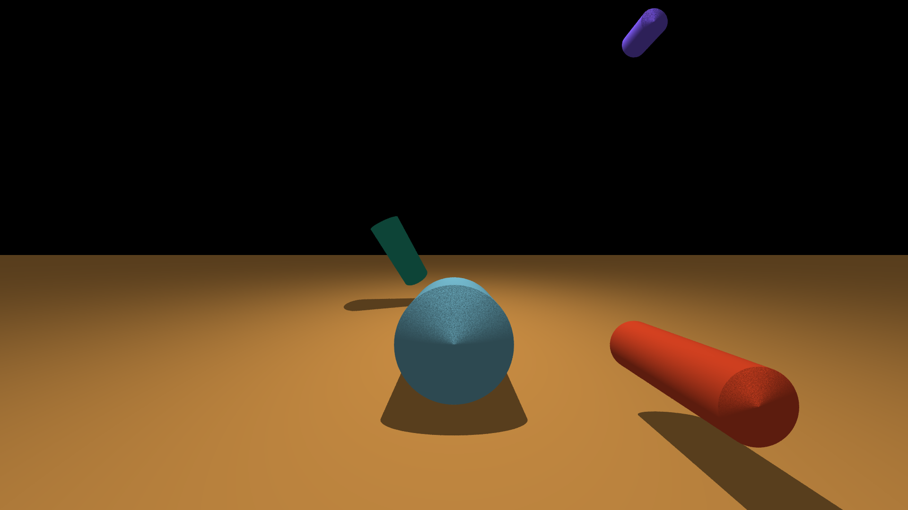
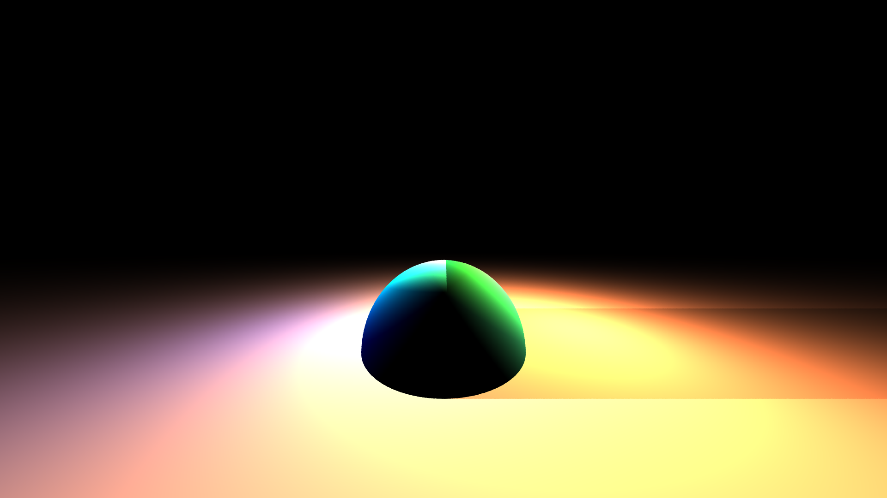
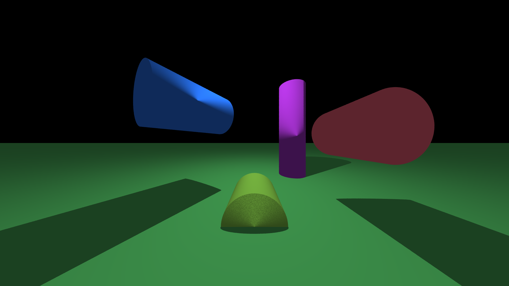
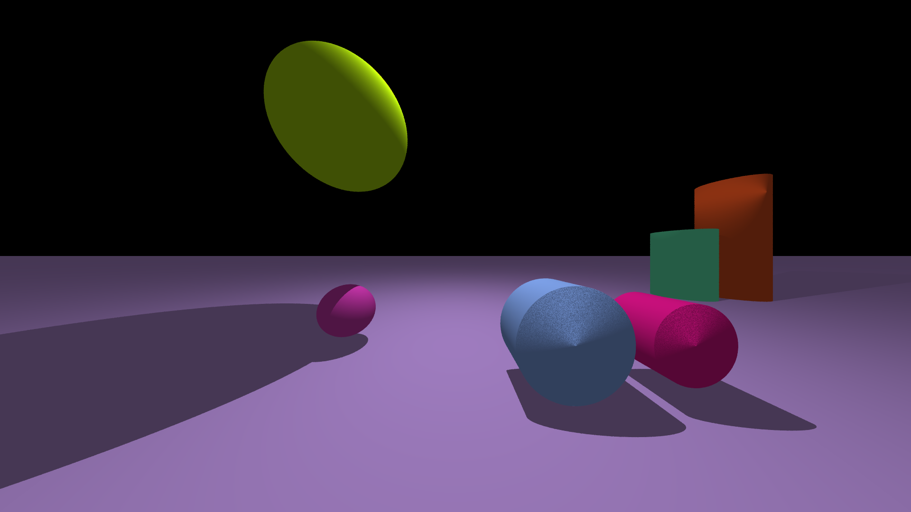
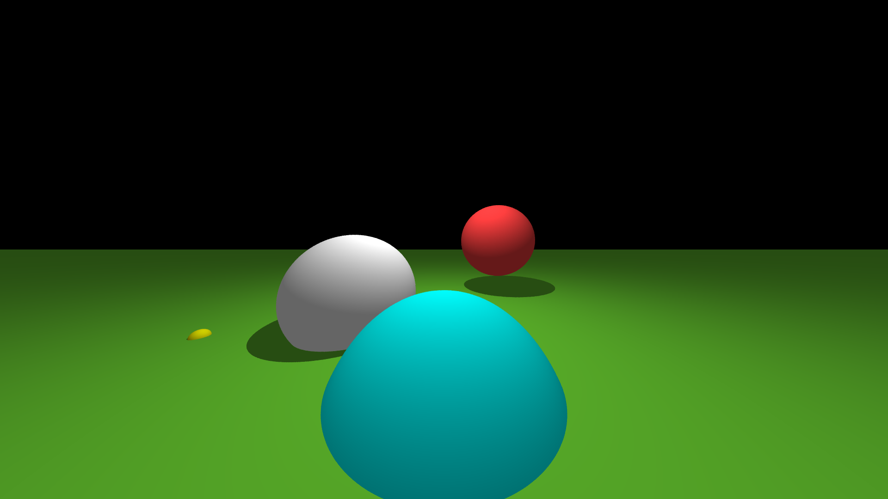
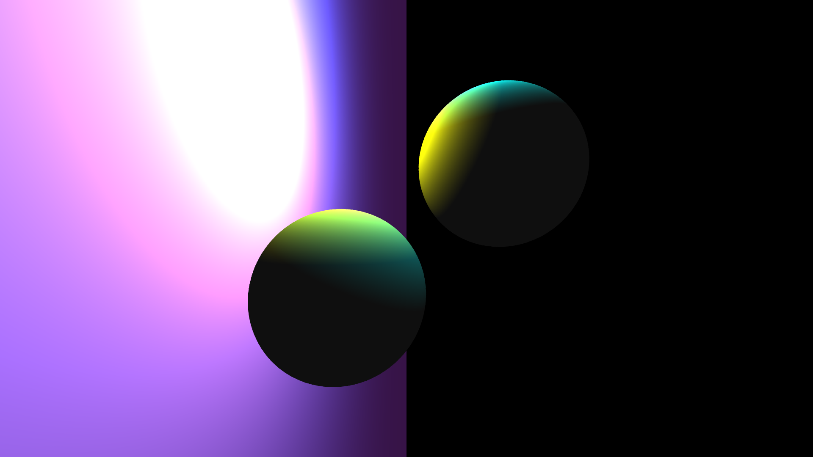
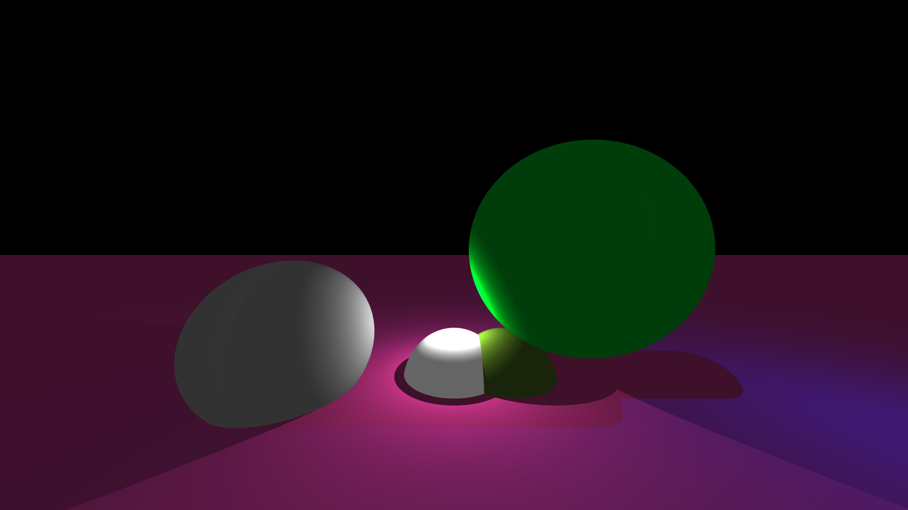

# Raytracer

Ray tracing is a technique used to generate realistic digital images by simulating the inverse path of light.
Your goal is to create a program able to generate an image from a file describing the scene.

```
∼/B-OOP-400> ./raytracer --help
USAGE: ./raytracer <SCENE_FILE>
SCENE_FILE: scene configuration
```

Here are some examples of the expected results:

## MANDATORY FEATURES

### MUST

Your raytracer **must** support the following features:

-   Primitives:
    -   Sphere
    -   Plane
-   Transformations:
    -   Translation
-   Light:
    -   Directional light
    -   Ambient light
-   Material:
    -   Flat color
-   Scene configuration:
    -   Add primitives to scene
    -   Set up lighting
    -   Set up camera
-   Interface:
    -   No GUI, output to a PPM file

```
This section lists only required features. The Architecture section lists other mandatory requirements.
```

### SHOULD

Once the previous features are working properly, you **should** add the following ones:

-   Primitives:
    -   Cylinder
    -   Cone
-   Transformation:
    -   Rotation
-   Light:
    -   Drop shadows

### COULD

Now that you’ve implemented the very basics of your raytracer, implement freely the following features:

-   Primitives:
    -   Limited cylinder _(0.5)_
    -   Limited cone _(0.5)_
    -   Torus _(1)_
    -   Tanglecube _(1)_
    -   Triangles _(1)_
    -   .OBJ file _(1)_
    -   Fractals _(2)_
    -   Möbius strip _(2)_
-   Transformations:
    -   Scale _(0.5)_
    -   Shear _(0.5)_
    -   Transformation matrix _(2)_
    -   Scene graph _(2)_
-   Light:
    -   Multiple directional lights _(0.5)_
    -   Multiple point lights _(1)_
    -   Colored light _(0.5)_
    -   Phong reflection model _(2)_
    -   Ambient occlusion _(2)_
-   Material:
    -   Transparency _(0.5)_
    -   Refraction _(1)_
    -   Reflection _(0.5)_
    -   Texturing from file _(1)_
    -   Texturing from procedural generation of chessboard _(1)_
    -   Texturing from procedural generation of Perlin noise _(1)_
    -   Normal mapping _(2)_
-   Scene configuration:
    -   Import a scene in a scene _(2)_
    -   Set up antialiasing through supersampling _(0.5)_
    -   Set up antialiasing through adaptative supersampling _(1)_
-   Optimizations:

    -   Space partitionning _(2)_
    -   Multithreading _(1)_
    -   Clustering _(3)_

-   Interface:
    -   Display the image during and after generation _(1)_
    -   Exit during or after generation _(0.5)_
    -   Scene preview using a basic and fast renderer _(2)_
    -   Automatic reload of the scene at file change _(1)_

The number in parentheses is the number of points given in the grading scale for each feature.

## SCENE FILE FORMAT

You **must** set up the rendered scene in an external file. We suggest you use the libconfig++library, but you
can also implement your own parser and syntax.

Here is an example of a scene file using libconfig++ file format. Feel free to modify its structure as you like.

```
# Configuration of the camera
camera :
{
  resolution = { width = 1920; height = 1080; };
  position = { x = 0; y = -100; z = 20; };
  rotation = { x = 0; y = 0; z = 0; };
  fieldOfView = 72.0; # In degree
};

# Primitives in the scene
primitives :
{
  # List of spheres
  spheres = (
    { x = 60; y = 5; z = 40; r = 25; color = { r = 255; g = 64; b = 64; }; } ,
    { x = -40; y = 20; z = -10; r = 35; color = { r = 64; g = 255; b = 64; }; }
  );

  # List of planes
  planes = (
    { axis = "Z"; position = -20; color = { r = 64; g = 64; b = 255; }; }
  );
};

# Light configuration
lights :
{
  ambient = 0.4; # Multiplier of ambient light
  diffuse = 0.6; # Multiplier of diffuse light

  # List of point lights
  point = (
    { x = 400; y = 100; z = 500; };
  );

  # List of directional lights
  directional = ();
};
```

This file would produce a picture looking like this:


## ARCHITECTURE

### INTERFACES

To allow extensibility, you **must** use interfaces at least for your primitives and lights.

### DESIGN PATTERNS

Additionally, you **must** use at least 2 design patterns from the following list in your project:

-   Factory
-   Builder
-   Composite
-   Decorator
-   Observer
-   State
-   Mediator

```
Your choices of design patterns will be discussed during the defense.
```

### AUTHORIZED LIBRARIES

The only authorized libraries are:

-   **libconfig++** to parse the scene configuration file
-   **SFML 2.5.1** for displaying

```
Only the standard C++ library, SFML and libconfig++ are authorized for mandatory features
```

## EXAMPLES OF OUR WORK











## FINAL MARK

### MARK: 31 / 60 (51.7%)

-   Preliminaries (2 / 2)
-   Primitives and lights interface (0.5 / 0.5)
-   Pure virtual interfaces (0.5 / 0.5)
-   Primitives container (1.5 / 2.5)
-   Design patterns (2 / 2)
-   Plugins (2 / 2.5)
-   Documentation (0.5 / 1)
-   Primitives (3 / 11)
-   Transformations (4 / 4)
-   Light (3.75 / 7)
-   Material (0.5 / 7.5)
-   Scene configuration (4.25 / 5.5)
-   Optimizations (0 / 6)
-   Interface (4.5 / 4.5)
-   Error handling (1 / 1)
-   Template (1 / 1)
-   Memory management (1 / 1)
